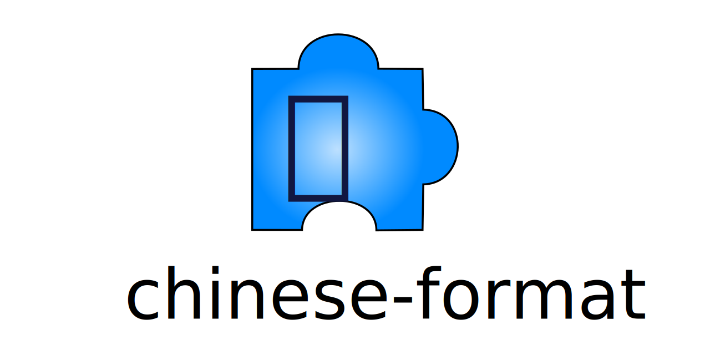

# chinese-format

_Convert data types to Chinese, with Rust_

This crate focuses on converting data types to `Chinese`,
which can be achieved by implementing the `ChineseFormat` trait.

As a consequence, it provides:

- **ready-made conversions** for standard data types such as integers,
  strings, ... - but also for fairly specific types like `DigitSequence`.

- **custom data types** - such as `Sign` and `Fraction`.

- the `Measure` trait and its related macros - especially `define_measure`.

## Features

By default, _all the features in this crate are enabled_:

- **digit-sequence**:

  - enables conversions to Chinese for [DigitSequence](https://crates.io/crates/digit-sequence).

  - enables the `Decimal` and `IntegerPart` types.

- **currency**: enables the whole `currency` module for monetary conversions.

- **gregorian**: enables the `gregorian` module for date/time conversions.

  _Also enables_: **digit-sequence**.

## Crates.io

https://crates.io/crates/chinese-format

## Documentation

https://docs.rs/chinese-format

## License

[MIT](LICENSE)
